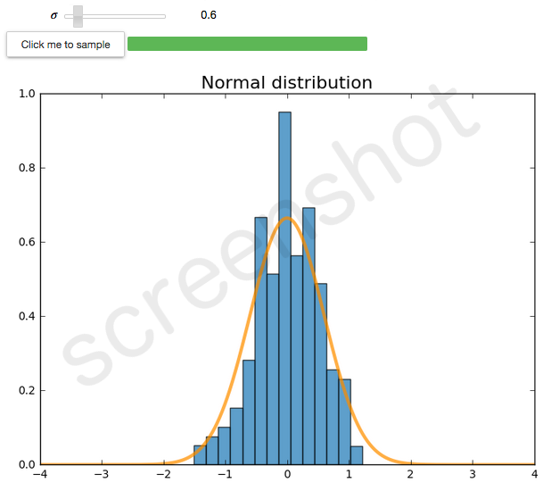

# InteractiveSampling

A Jupyter Notebook live sampling of a gaussian distribution.

## Usage

Move the slider to set the value of the standard deviation. Then click the button and enjoy your live sampling!

## Libraries used

matplotlib, scipy, numpy, ipywidgets.
